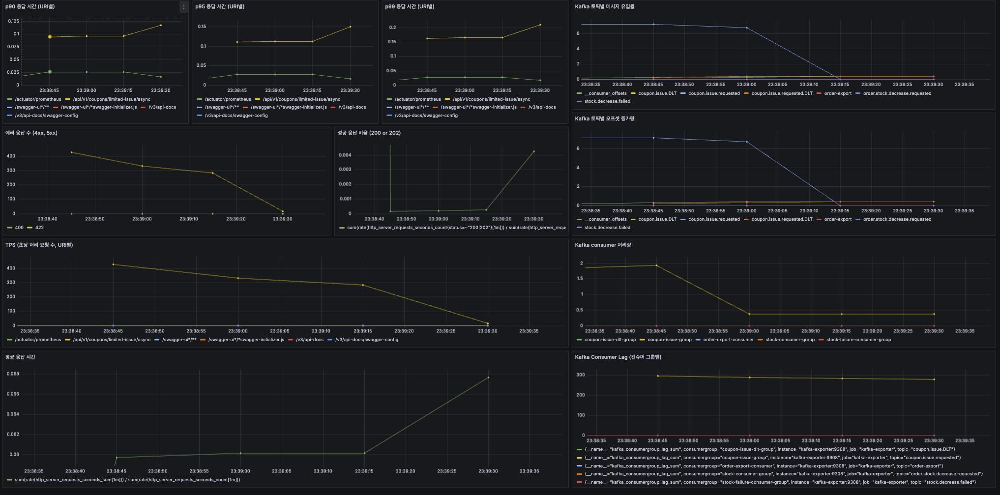

# ✅ STEP 20. 장애 대응 설계 보고서 (쿠폰 비동기 발급 API)

---

## 🎯 테스트 목적

Kafka 기반 비동기 쿠폰 발급 구조에서 **고부하 요청** 상황 시 발생 가능한 장애 유형을 정의하고,  
DLQ, Kafka Lag, 처리 실패율 등 **메트릭 기반 징후**를 중심으로 Short/Mid/Long-term 대응 전략을 수립한다.  
이 과정에서 시스템 병목을 유발하는 요소를 명확히 분석하고, 안정적 운영을 위한 구조 개선 방향까지 도출한다.

---

## ⚠️ 장애 시나리오 정의

| 시나리오 | 설명 | 영향 |
| -------- | ----- | ---- |
| Kafka 브로커 중단 | Kafka 메시지 전송 실패 | 쿠폰 발급 지연 또는 누락 |
| Kafka Consumer 다운 | 메시지 소비 실패 | Lag 증가, 쿠폰 미발급 |
| Redis 연결 지연 | Sentinel 전환 중 블로킹 | 발급 처리 중단 |
| DLQ 급증 | Consumer 처리 실패 | 쿠폰 손실 및 재처리 필요 |
| 유효하지 않은 요청 | 만료 or 소진된 쿠폰 요청 | 응답 실패율 증가 (4xx 폭증) |

---

## 📊 지표 기반 장애 징후 (부하 테스트 결과 기반)

| 항목 | 관찰 결과 |
| -------- | ------------ |
| 평균 응답 시간 | `72.11ms` |
| TPS | `690 req/s` |
| P90 / P95 응답 시간 | `113.64ms / 134.38ms` |
| Kafka Consumer 처리량 | `~1.7 req/s` |
| Kafka Consumer Lag | 최대 `300` 이상 |
| DLQ 메시지 발생량 | 토픽 `coupon.issue.DLT`에 메시지 다수 유입 |
| 에러율 (`http_req_failed`) | `81.01%` (4xx 다수) |

> `/api/v1/coupons/limited-issue/async` 요청 총 20,748건 중 절반 이상 실패  
> Kafka 처리량에 비해 Consumer 처리 속도가 낮아 Lag이 급증

---

---

## 🛠 장애 대응 전략

### ✅ Short-term (즉시 대응)

| 항목 | 조치 |
| -------- | -------- |
| Kafka Consumer 다운 | Auto Restart 설정 및 Lag 기준 알림 |
| DLQ 메시지 발생 | 로그 기반 수동 분석 + Slack Alert |
| Redis 장애 | Retry with Backoff + Sentinel Failover 설정 |
| 클라이언트 요청 오류 | 4xx 응답 메시지 개선 (쿠폰 만료, 중복 등 안내) |

---

### ✅ Mid-term (지속 개선)

| 항목 | 조치 |
| -------- | -------- |
| Kafka 처리량 확장 | Consumer Group 병렬 구성, 처리 스레드 분산 |
| DLQ 자동 재처리 | DLQ 전용 Consumer 추가 + Slack/Email Alert 연동 |
| 요청 유효성 검증 | 쿠폰 캐싱 or Pre-check API 도입 |
| Redis 안정화 | Sentinel 구조 최적화 + 운영지표 모니터링 강화 |

---

### ✅ Long-term (구조 개선)

| 항목 | 조치 |
| -------- | -------- |
| 메시지 유실 방지 | Outbox Pattern → Kafka 전송 구조로 전환 |
| 복구 자동화 | DLQ 메시지 재처리 Admin UI 도입 + Retry API 구성 |
| 시스템 확장성 | 쿠폰 도메인 MSA 분리 → 발급/조회 독립 배포 |
| 자동 확장 대응 | Kafka Consumer Horizontal Auto Scaling (CPU 기준) 도입 |

---

## 🔁 핵심 지표 기준 정리

| 지표 | 기준 |
| -------- | ----------- |
| Kafka Consumer Lag | 경고: ≥100 / 장애대응: ≥300 |
| DLQ 메시지 수 | ≥5건 이상 시 알림 전송 및 재처리 트리거 |
| 평균 응답 시간 | 150ms 초과 지속 시 병목 진단 |
| TPS | 기준선 700/s → 하락 시 처리 병목 의심 |
| http_req_failed | ≥50% → 유효성 문제 or 부하 과다 |

---

## ✅ 결론

- Kafka 기반 구조는 **대량 요청 수용에는 적합**하지만, **Consumer 처리 속도**가 병목으로 작용함
- DLQ 운영으로 유실은 방지되었으나, **자동 복구 체계 부재**로 장애 대응 지연 가능
- 유효하지 않은 요청에 대한 **사전 검증 부족**으로 인한 4xx 폭증은 실제 서비스 장애로 연결 가능
- 장기적으로는 **도메인 분리, 자동화된 재처리, 확장 가능한 Consumer 구조** 확보를 통해 회복력 있는 시스템을 구축해야 함
